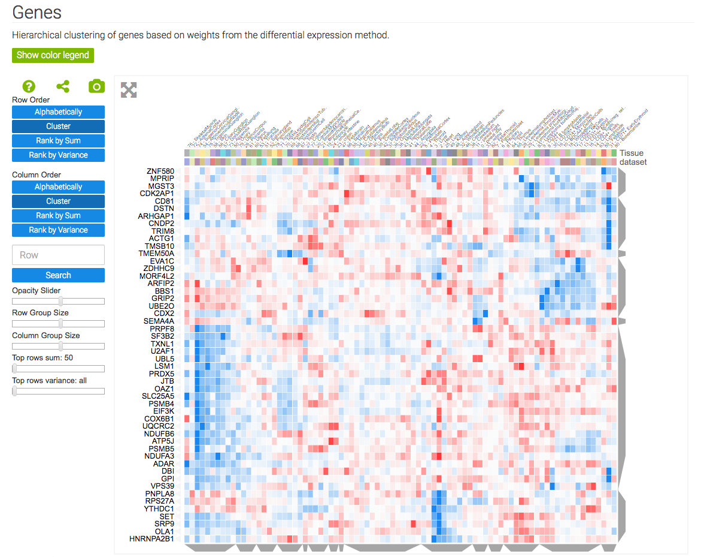

.. _app_integration:

App Integration Examples
------------------------
Clustergrammer can be integrated into web applications to dynamically produce interactive visualizations -- see :ref:`building_web_page` for information. Clustergrammer is currently being utilized to visualize data for the following `Ma'ayan lab`_ web applications:

Enrichr
=======
The enrichment analysis tool, `Enrichr`_, uses Clustergrammer to produce dynamic heatmaps of enriched terms as columns and user input genes as rows. This helps users understand the relationships between their input genes and the returned enriched terms.

.. figure:: _static/enrichr_screenshot_logo.png
  :width: 550px
  :align: center
  :alt: Enirchr Clustergram
  :target: http://amp.pharm.mssm.edu/Enrichr/

  `Enrichr`_ uses :ref:`clustergrammer_web`'s API to produce interactive heatmaps of enriched terms as columns and user input genes as rows.

GEN3VA
======
The gene signature analysis and visualization tool, `GEN3VA`_, uses Clustergrammer's core libraries, :ref:`clustergrammer_js` and :ref:`clustergrammer_py`, to dynamically visualize collections of gene expression signatures collected by users from `GEO`_ as interactive heatmaps. GEN3VA also uses Clustergrammer to visualize enrichment analysis results (obtained from `Enrichr`_) and perturbations that reverse or mimic gene expression signatures (obtained from `L1000CDS2`_)

  `GEN3VA`_ uses Clustergrammer's core libraries, :ref:`clustergrammer_js` and :ref:`clustergrammer_py`, to visualie gnee expression signatures and enrichment analysis results.

L1000CDS2
=========
`L1000CDS2`_ uses the :ref:`clustergrammer_web`'s API to produce interactive heatmaps of perturbagen gene signatures that mimic or reverse an input gene signature. This can be useful for users that are interested in the specific genes that are differentially regulated by the identified perturbagens.

.. figure:: _static/l1000cds2_screenshot.png
  :width: 800px
  :align: center
  :alt: L1000CDS2 Clustergram
  :target: http://amp.pharm.mssm.edu/clustergrammer/l1000cds2/55e0b68a5bf3665f1a726bfa

  `L1000CDS2`_ uses Clustergrammer to produce interactive visualizations of input gene signatures and mimicking or reversing perturbation signatures. A users's input signature is shown as rows with gene-expression levels shown as row-bars (red/blue for up/down expression) and perturbations found to mimic/reverse their signature are shown as columns in the heatmap.

Harmonizome
===========
The `Harmonizome`_ uses :ref:`clustergrammer_web`'s API to generate visualize of curated biological datasets as heatmaps and adjacency matrices (to depict networks). The Harmonizome also uses the Clustergrammer to visualize the amount of biological information that is available for different families of genes in the `Harmonogram`_

.. figure:: _static/hzome_sim_mat.png
  :width: 800px
  :align: center
  :alt: Harmonizome Similarity Heatmap
  :target: http://amp.pharm.mssm.edu/Harmonizome/visualize/heat_map/attribute_similarity

  The `Harmonizome`_ uses Clustergrammer to visualize datasets as heatmaps and similarity matrices (e.g. similarity of attributes based on shared genes). Above is an example similarity matrix of KEGG pathways.

.. _`Enrichr`: http://amp.pharm.mssm.edu/Enrichr/
.. _`GEN3VA`: http://amp.pharm.mssm.edu/gen3va/
.. _`L1000CDS2`: http://amp.pharm.mssm.edu/l1000cds2/
.. _`GEO2Enrichr`: http://amp.pharm.mssm.edu/g2e/
.. _`Harmonizome`: http://amp.pharm.mssm.edu/Harmonizome/
.. _`GEO`: https://www.ncbi.nlm.nih.gov/geo/
.. _`L1000CDS2': http://amp.pharm.mssm.edu/l1000cds2/#/index
.. _`Harmonogram`: http://amp.pharm.mssm.edu/harmonogram/
.. _`Ma'ayan lab`: http://labs.icahn.mssm.edu/maayanlab/