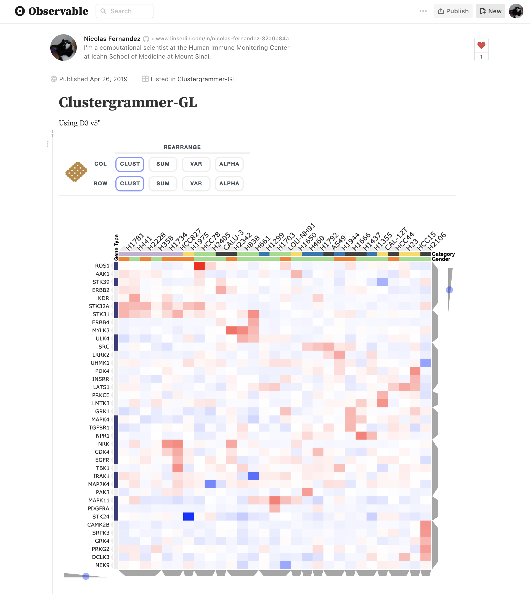

.. _clustergrammer_gl:

Clustergrammer-GL
-----------------

Clustergrammer-GL is the new WegGL front end JavaScript library. This new library can visualize much larger datasets (matrices with ~millions of matrix-cells) and is being utilized by the new in-development Jupyter Widget, Clustergrammer2. Clustergrammer-GL can be used as a stand-alone visualization library and as well as the JavaScript notebook service `Observable`_ (see `Clustergrammer-GL Observable Notebook`_)

Clustergrammer-GL is being built using the WebGL library `regl`_, is free and open-source, and can be found on `GitHub`_.

Check back soon for more updates.

.. _`GitHub`: https://github.com/ismms-himc/clustergrammer-gl
.. _`regl`: http://regl.party/
.. _`Observable`: https://observablehq.com/
.. _`Clustergrammer-GL Observable Notebook`: https://observablehq.com/@cornhundred/clustergrammer-test