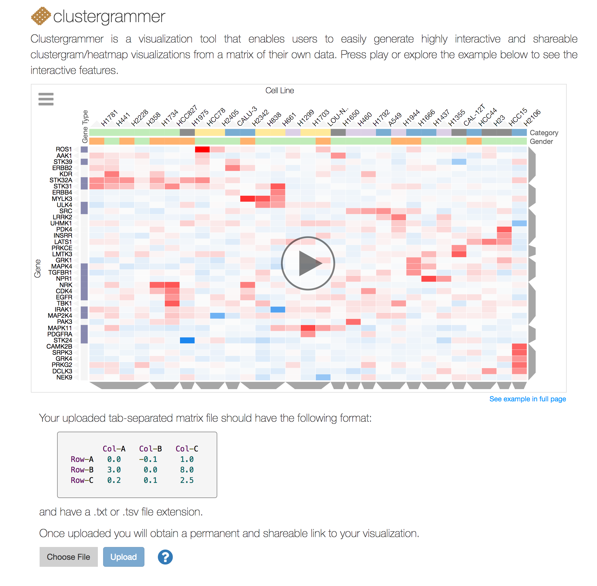

.. _clustergrammer_web:

Clustergrammer Web App
----------------------
|github-version|

The Clustergrammer web application, Clustergrammer-Web, enables users to easily generate interactive and shareable heatmap visualizations by uploading their matrix as a tab-separated file.

.. _clustergrammer_web_upload:

Uploading Data using the Homepage
=================================

  Users can easily generate an interactive and shareable heatmap visualization using the `Clustergrammer Web App`_. Simply upload a tab-separated matrix file in the homepage to be directed to a permanent and shareable visualization of your data.

.. _clustergrammer_web_viz:

Clustergrammer-Web Visualization
================================
Uploading a matrix to Clustergrammer-Web will redirect the user to a new permanent and shareable page with three views of their data:

#. clustered heatmap view of their matrix
#. clustered similarity matrix of the columns in their original matrix
#. clustered similarity matrix of the rows in their original matrix

.. _clustergrammer_web_api:

Clustergrammer-Web API
======================
Clustergrammer-Web's RESful API enables users to programmatically generate visualizations. The API can be useful for users that need to generate many clustergrams or developers that need to automatically generate visualizations for their own web application.

*Matrix Upload*

Users can post a matrix file to Clustergrammer-Web using the endpoint
::

  http://amp.pharm.mssm.edu/clustergrammer/matrix_upload/

and receive a permanent link to their visualization. Below is an example in Python 2.7 showing the post request and how to obtain the link from the response object:
::

  import requests

  filename = 'example_matrix.txt'
  upload_url = 'http://amp.pharm.mssm.edu/clustergrammer/matrix_upload/'

  r = requests.post(upload_url, files={'file': open(filename, 'rb')})

  link = r.text

.. _clustergrammer_web_dev:

Clustergrammer-Web Development
==============================
Clustergrammer-Web is a `dockerized`_ web application built using the Python library `Flask`_ and `MongoDB`_ database. Clustergrammer-Web uses the :ref:`clustergrammer_js` and :ref:`clustergrammer_py` libraries and the source code can be found in the `clustergrammer-web`_ GitHub repo.

.. _`Clustergrammer-Web App`: http://amp.pharm.mssm.edu/clustergrammer/
.. _`Flask`: http://flask.pocoo.org/
.. _`dockerized`: https://docs.docker.com/
.. _`clustergrammer-web`: https://github.com/MaayanLab/clustergrammer-web/
.. _`MongoDB`: https://www.mongodb.com/

.. |github-version| image:: https://img.shields.io/github/release/MaayanLab/clustergrammer-web.svg
    :alt: version
    :scale: 100%
    :target: https://github.com/MaayanLab/clustergrammer-web