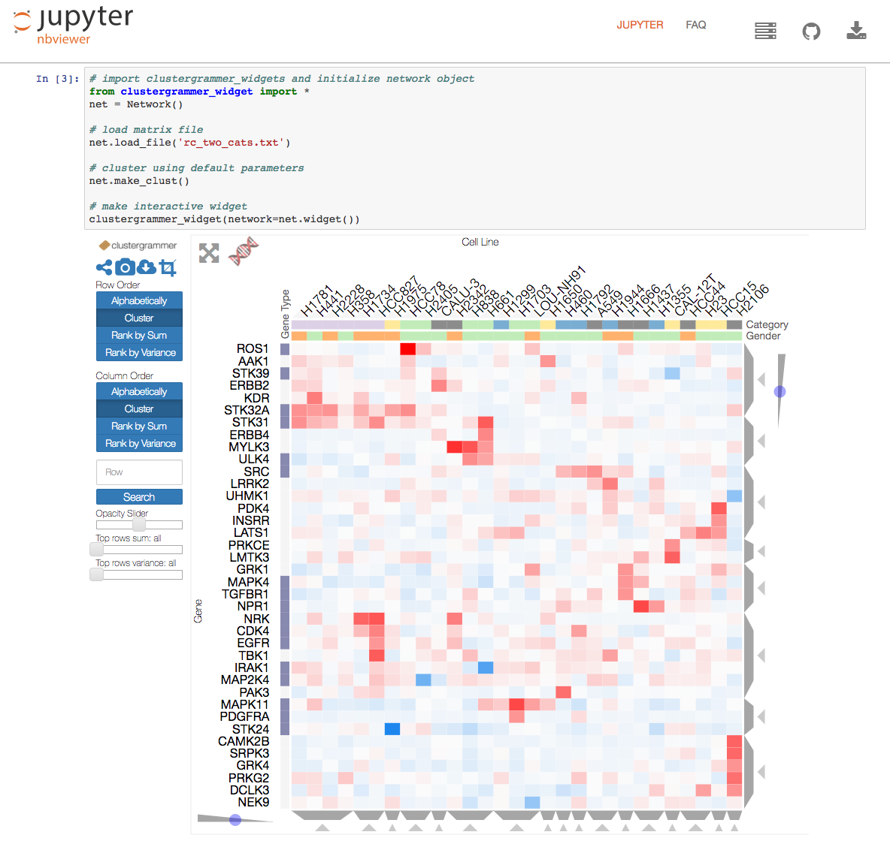

.. _clustergrammer_widget:

Clustergrammer Jupyter Widget
-----------------------------
|pypi-version|
|npm-version|

Jupyter notebooks are ideal for generating reproducible workflows and analysis. They are also the best way to share Clustergrammer's interactive visualizations while providing context, analysis, and the underlying data to enable reproducibility (see :ref:`clustergrammer_widget_examples`). The Clustergrammer Widget enables users to easily produce interactive visualizations within a `Jupyter`_ notebook that can be shared with collaborators (using `nbviewer`_). Clustergrammer-Widget can be used to visualize a matrix of data from a file or from a `Pandas`_ DataFrame (see :ref:`matrix_format_io` for more information). See screenshot below for an example visualization:

  Clustergrammer can be used as an interactive widget within a Jupyter notebook and shared using nbviewer (see `Running_clustergrammer_widget.ipynb`_ example).

.. _clustergrammer_widget_dependencies:

Jupyter Widget Dependencies
===========================

- `Numpy`_
- `SciPy`_
- `Pandas`_
- `ipywidgets`_

Clustergrammer-Widget works with Python 2 and 3.

Installation
============
To use the :ref:`clustergrammer_widget` users need to install: `Python`_, `Jupyter`_ notebook, the widget dependencies (see :ref:`clustergrammer_widget_dependencies`), and `ipywidgets`_ version >6.0.0 (to save the notebook with widgets). Users can `install Anaconda`_, a Python distribution that includes the Jupyter notebook as well as other scientific computing libraries, to easily obtain the necessary dependencies (except ipywidgets version >6.0.0). The ``clustergrammer_widget`` can the be installed (with pip) and enabled using the following commands:

::

  pip install --upgrade clustergrammer_widget
  jupyter nbextension enable --py --sys-prefix widgetsnbextension
  jupyter nbextension enable --py --sys-prefix clustergrammer_widget

.. _clustergrammer_widget_workflow:

Clustergrammer-Widget Workflow Example
======================================
The Jupyter notebook `Running_clustergrammer_widget.ipynb`_ (which is rendered using `nbviewer`_) shows how to visualize a matrix from a file and a `Pandas`_ DataFrame. The following examples are taken from this notebook.

Here we are visualizing a matrix of data from a file (e.g. ``rc_two_cats.txt``). We start by making an instance of the ``Network`` object, ``net``, which is used to load and cluster the data. Then we pass the data to ``clustergrammer_widget`` to generate the visualization (for more information about the ``Network`` class, see :ref:`clustergrammer_py_api`):
::

  # import clustergrammer_widgets and initialize network object
  from clustergrammer_widget import *
  net = Network()

  # load matrix file
  net.load_file('rc_two_cats.txt')

  # cluster using default parameters
  net.make_clust()

  # make interactive widget
  clustergrammer_widget(network=net.widget())

Clustergrammer-Widget can also be used as a general purpose `Pandas`_ DataFrame viewer. Below is an example of how to visualize a Pandas DataFrame, ``df``, by loading it into the same ``net`` object from above:
::

  # load DataFrame
  net.load_df(df)

  # cluster using default parameters
  net.make_clust()

  # make interactive widget
  clustergrammer_widget(network=net.widget())

Loading new data into ``net`` clears out the old data, which allows ``net`` to be easily reused within the same notebook. The ``net`` object can also be used to filter and normalize your data before visualizing (note that filtering and normalization are permanent and irreversible). The example below performs Z-score normalization on the columns, and filters to keep the top 200 rows based on their absolute value sum:
::

  # Z-score normalize columns
  net.normalize(axis='col', norm_type='zscore', keep_orig=True)

  # filter for the top 200 rows based on their absolute value sum
  net.filter_N_top('row', 200, 'sum')

  # make interactive widget
  clustergrammer_widget(network=net.widget())

In the examples above, we clustered our matrix using the default parameters. For more information about the ``Network`` object and additional options; see the :ref:`clustergrammer_py_api`.

.. _clustergrammer_widget_examples:

Sharing with nbviewer
=====================
To enable rendering interactive widgets on `nbviewer`_ you must have `ipywidgets version 6`_  or later installed and use the "Save Notebook with Widgets" action in the Widgets menu in the Jupyter notebook (see ipywidgets `Rendering Interactive Widgets on nbviewer`_ documentation and screenshot below):

.. figure:: _static/jupyter_save_widgets.png
  :width: 500px
  :align: left
  :alt: Save Jupyter Widget

  Users can save notebooks with interactive HTML widgets using the "Save Notebook with Widgets" action in the Jupyter Notebook Widgets menu as shown here. `ipywidgets version 6`_  or later must be installed in order to enable this feature.

Jupyter Notebook Examples
=========================
Clustergrammer has been applied to visualize and analyze a wide variety of biological and non-biological data. See the Jupyter notebooks below for examples:

- `Running_clustergrammer_widget.ipynb`_
- `DataFrame_Example.ipynb`_
- `Single Cell RNA-seq Visualization.ipynb`_
- `Iris Dataset.ipynb`_

.. _clustergrammer_widget_dev:

Clustergrammer-Widget Development
=================================
Clustergrammer-Widget's source code can be found in the `clustergrammer-widget`_ GitHub repo. Clustergrammer-Widget is built using the `ipywidgets`_ framework (using the `cookie cutter`_ template).

Please :ref:`contact` Nicolas Fernandez or Avi Ma'ayan with questions or use the GitHub `issues`_ feature to report an issue.

.. _`ipywidgets version 6`: https://github.com/ipython/ipywidgets/releases
.. _`ipywidgets`: http://ipywidgets.readthedocs.io/en/latest/
.. _`cookie cutter`: https://github.com/jupyter/widget-cookiecutter
.. _`issues`: https://github.com/MaayanLab/clustergrammer-widget/issues
.. _`clustergrammer-widget`: https://github.com/MaayanLab/clustergrammer-widget
.. _`nbviewer`: http://nbviewer.jupyter.org/
.. _`Rendering Interactive Widgets on nbviewer`: http://ipywidgets.readthedocs.io/en/latest/embedding.html?highlight=save#rendering-interactive-widgets-on-nbviewer
.. _`Running_clustergrammer_widget.ipynb`: http://nbviewer.jupyter.org/github/MaayanLab/clustergrammer-widget/blob/master/Running_clustergrammer_widget.ipynb

.. _`DataFrame_Example.ipynb`: http://nbviewer.jupyter.org/github/MaayanLab/clustergrammer-widget/blob/master/DataFrame_Example.ipynb

.. _`Single Cell RNA-seq Visualization.ipynb`: http://nbviewer.jupyter.org/github/MaayanLab/single_cell_RNAseq_Visualization/blob/master/Single%20Cell%20RNAseq%20Visualization%20Example.ipynb

.. _`Iris Dataset.ipynb`: http://nbviewer.jupyter.org/github/MaayanLab/iris_clustergrammer_visualization/blob/master/Iris%20Dataset.ipynb

.. _`Pandas`: http://pandas.pydata.org/
.. _`Numpy`: http://www.numpy.org/
.. _`SciPy`: https://www.scipy.org/
.. _`nbviewer`: http://nbviewer.jupyter.org/
.. _`Python`: https://www.python.org/
.. _`Jupyter`: http://jupyter.org/
.. _`install Anaconda`: https://www.continuum.io/downloads

.. |pypi-version| image:: https://img.shields.io/pypi/v/clustergrammer_widget.svg
    :alt: pypi-version
    :scale: 100%
    :target: https://pypi.python.org/pypi?:action=display&name=clustergrammer_widget

.. |npm-version| image:: https://img.shields.io/npm/v/clustergrammer_widget.svg
    :alt: npm-version
    :scale: 100%
    :target: https://www.npmjs.com/package/clustergrammer_widgt