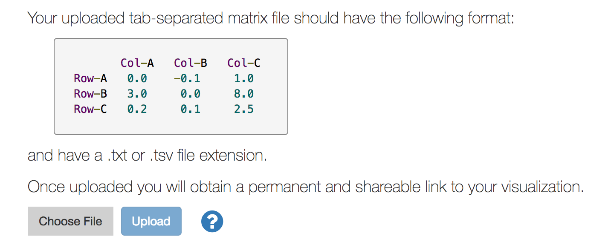

Getting Started
---------------

Introduction
============
Clustergrammer is a web-based tool for visualizing high-dimensional data as interactive and shareable hierarchically clustered heatmaps. Clustergrammer can be used in three main ways:

#. :ref:`clustergrammer_web`
#. :ref:`clustergrammer_widget`
#. :ref:`clustergrammer_js` and :ref:`clustergrammer_py` libraries

This section will provide instructions on how to quickly generate a visualization from a matrix of data using the :ref:`clustergrammer_web` and the :ref:`clustergrammer_widget` as well as instructions on how to interact with the visualization. For developers interested in building their own web page using Clustergrammer, please see the :ref:`building_web_page` section.

.. _getting_started_web_app:

Clustergrammer-Web
==================
Users can easily generate an interactive and shareable heatmap visualization using the :ref:`clustergrammer_web`. Simply upload a tab-separated matrix file at the `homepage`_ (see screenshot below) to be redirected to a permanent and shareable visualization of your data.

  Users can upload their data using the web app `homepage`_. Simply choose your file and upload to be redirected to your permanent and shareable visualization.

Once you upload your data, the :ref:`clustergrammer_web` clusters your data and produces three views: a heatmap of your input matrix, a similarity matrix of your columns, and a similarity matrix of your rows. See screenshots below and `example visualization`_ for an example results page.

**Heatmap View**

.. figure:: _static/web_app_heatmap.png
  :width: 800px
  :align: center
  :alt: Web application heatmap
  :target: http://amp.pharm.mssm.edu/clustergrammer/viz_sim_mats/58a492b4a63cb826f0be6476/rc_two_cats.txt

  Above is an example clustergram visualization produced by the :ref:`clustergrammer_web`. Clustergrammer produces three views of your data and the clustered heatmap view is shown above.

**Similarity Matrix View**

.. figure:: _static/web_app_sim_mat.png
  :width: 800px
  :align: center
  :alt: Web application sim-mat
  :target: http://amp.pharm.mssm.edu/clustergrammer/viz_sim_mats/58a492b4a63cb826f0be6476/rc_two_cats.txt

  Clustergrammer produces similarity matrices of rows and columns to provide additional perspectives on a user's data. Above is an example column similarity matrix.

See :ref:`interacting_with_viz` for more information.

.. _getting_started_widget:

Clustergrammer-Widget
=====================
Here is a link to a notebook with an example interactive widget hosted on nbviewer:
`Interactive Widget <http://nbviewer.jupyter.org/github/MaayanLab/clustergrammer-widget/blob/master/Running_clustergrammer_widget.ipynb>`_

Interacting with Clustergrammer
===============================
Clustergrammer produces highly interactive visualizations that enable intuitive exploration of high-dimensional data including:

- :ref:`zooming_and_panning`
- :ref:`row_col_reordering` (e.g. reorder based on sum)
- :ref:`interactive_dendrogram`
- :ref:`interactive_dim_reduction` (e.g. filter rows based on variance)a
- :ref:`interactive_categories`
- :ref:`crop`
- :ref:`search`

Press play or interact with the gene-expression demo below to see some of Clustergrammer's interactive features and see :ref:`interacting_with_viz` for more information:

.. raw:: html

   <iframe id='iframe_preview' src="http://amp.pharm.mssm.edu/clustergrammer/demo/" frameBorder="0" style='height: 495px; width:730px; margin-bottom:15px;'></iframe>

Clustergrammer also has :ref:`biology_specific_features` for working with gene-level data including:

- mouseover gene names and description look-up (using `Harmonizome`_)
- enrichment analysis to find biological information (e.g. up-stream transcription factors) specific to your set of genes (using `Enrichr`_)

.. _`example visualization`: http://amp.pharm.mssm.edu/clustergrammer/viz_sim_mats/58a492b4a63cb826f0be6476/rc_two_cats.txt
.. _`Enrichr`: http://amp.pharm.mssm.edu/Enrichr/
.. _`Harmonizome`: http://amp.pharm.mssm.edu/Harmonizome/
.. _`homepage`: http://amp.pharm.mssm.edu/clustergrammer/