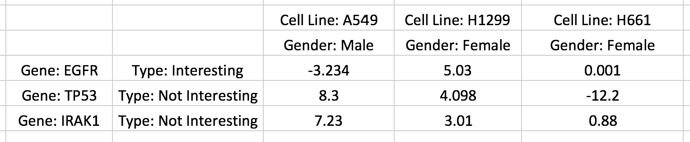

.. _matrix_format_io:

Matrix Formats and Input/Output
------------------------------
Clustergrammer takes as input either:

- a tab-separated matrix file
- a Pandas DataFrame (using :ref:`clustergrammer_py`)

The tab-separated matrix file can take several formats shown below, which can include row/column categories and name/category titles. In call cases, row and column names must be unique. Optional, name/category titles will be shown as titles above row/column names or names adjacent to row/column categories, respectively. The front-end :ref:`clustergrammer_js` library can visualize matrices up to ~500,000 to ~1,000,000 cells large, but very large matrices may take a long time to cluster using the :ref:`clustergrammer_py` library. Clustergrammer is also optimized to visualize matrices with more rows than columns. Users are encouraged to arrange their matrix with data-points as columns and dimensions as rows, which enables users to take advantage of Clustergrammer's :ref:`interactive_dim_reduction`.

Simple Matrix Format
====================
The simplest tab-separated file format is shown here:
::

  	Col-A	Col-B	Col-C
  Row-A	0.0	-0.1	1.0
  Row-B	3.0	0.0	8.0
  Row-C	0.2	0.1	2.5

The first line gives the column names and starts with a blank tab. The first column of each row gives the name of this row followed by the data in each row of the matrix. See `example_tsv.txt`_ for an example of this matrix format.

Simple Matrix-Category Format
=============================
Row and column categories can also be included in the matrix in the following way:

This screenshot of an Excel spreadsheet shows a single row category being added as an additional column of strings (e.g. ``Type: Interesting``) and a single column category being added as an additional row of strings (e.g. ``Gender: Male``). Up to 15 categories can be added in a similar manner. Titles for row or column names or categories can be added by prefixing each string with ``'Title: '`` (note that a space after the colon). For example the title of the column names is ``Cell Line`` and the title of the row categories is ``Gender``. See `rc_two_cats.txt`_ for an example of this matrix format.

Tuple Matrix-Category Format
============================
Row/column names and categories can also be encoded as Python tuples as shown below:

::

		('Cell Line: A549', 'Gender: Male')	('Cell Line: H1299', 'Gender: Female')	('Cell Line: H661', 'Gender: Female')
	('Gene: EGFR','Type: Interesting')	-3.234	5.03	0.001
	('Gene: TP53','Type: Not Interesting')	8.3	4.098	-12.2
	('Gene: IRAK','Type: Not Interesting')	7.23	3.01	0.88

This format is easier to work with in Python and can be imported/exported easily into Pandas DataFrames and as tab-separated files. Note that titles have been added to row/column names and categories as discussed above. See `tuple_cats`_ for an example of this matrix format.

Category Types: String and Value
================================
Row and column categories can be of type: string or value. If categories are given as strings (e.g. containing letters and not just numbers) then categories will be depicted using different colors. If categories are of type value (e.g. all categories contain no letters and only numbers) then categories will be depicted using a two colors (gray for positive and orange for negative) and the value will be depicted as opacity (similar to how matrix cells are visually encoded).

Value-based categories can be useful for adding a dimension of data to your visualization (e.g. time) that you would like to compare to your other dimensions, but would not like to influence your clustering. Value-based and String-based categories can also be used to reorder your matrix (see :ref:`interactive_categories`).

Matrix File Examples
====================
Several example tab-separated matrix files can be found in `example matrix files`_.

Matrix Input/Output to Clustergrammer.py
============================================
Clustergrammer.py can load a matrix directly from a file or from a Pandas DataFrame as well as export to a file or Pandas DataFrame:
::

	# initialize Network object
	from clustergrammer import Network
	net = Network()

	# load matrix
	##############

	# load data from file
	net.load_file('your_matrix.txt')

	# load data from Pandas DataFrame, saved as variable df
	net.load_df(df)

	# export matrix
	################

	# export to tsv
	net.export_matrix_to_tsv('filename.txt')

	# export Pandas DataFrame
	df_export = net.export_df()

For more information about Clustergrammer.py and its API see :ref:`clustergrammer_py`.

.. _`example matrix files`: https://github.com/MaayanLab/clustergrammer/tree/master/txt
.. _`example_tsv.txt`: https://github.com/MaayanLab/clustergrammer/blob/master/txt/example_tsv.txt
.. _`rc_two_cats.txt`: https://github.com/MaayanLab/clustergrammer/blob/master/txt/rc_two_cats.txt
.. _`tuple_cats`: https://github.com/MaayanLab/clustergrammer/blob/master/txt/tuple_cats.txt